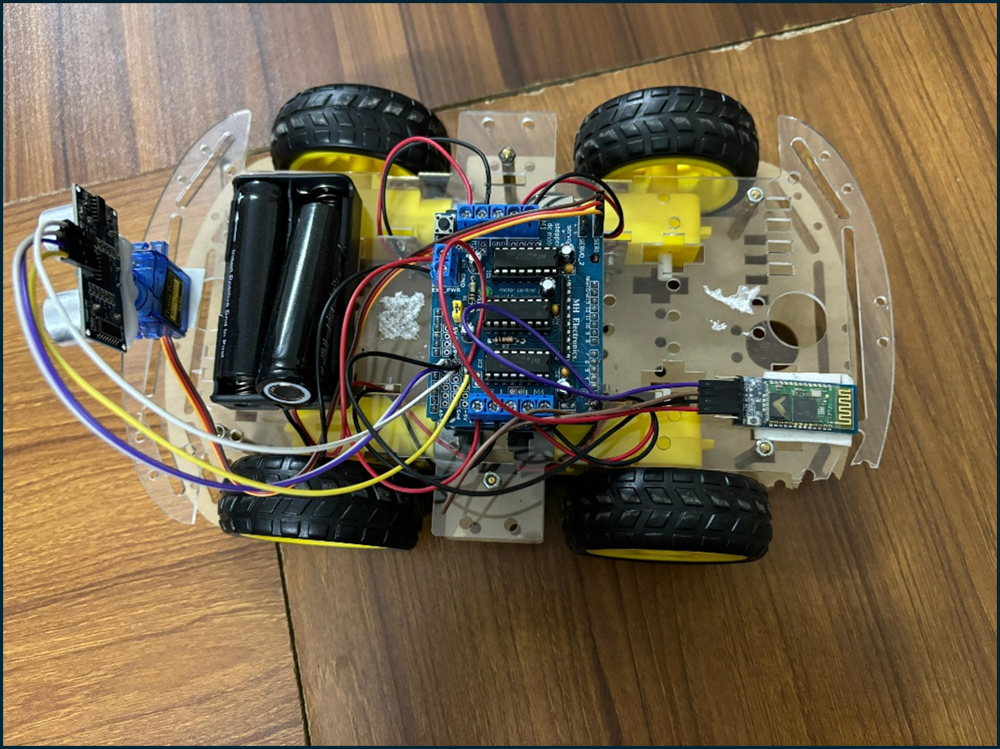

<!-- Logo -->
<p align="center">
  
</p>

<!-- Title Banner -->
<p align="center">
  
</p>

<h3 align="center">
  <b style="color:purple;">🤖 Voice-Controlled & Obstacle-Avoiding Robot</b>
</h3>

<h3 align="center">
  <b>📱 Mobile-Integrated Arduino Robot for Smart Navigation</b>
</h3>

<p align="center">
  
  
  
  
  
</p>


<!-- Overview Banner -->


**ShobdoBondhu (শব্দবন্ধু)** is a **voice-controlled and obstacle-avoiding Arduino robot** that combines **mobile-based voice commands** (both English & Bangla) with **autonomous navigation**.

It listens to verbal instructions via a smartphone app, interprets them through a Bluetooth module, and navigates safely using an ultrasonic sensor mounted on a servo motor. If an obstacle is detected, it intelligently scans its surroundings and chooses a clear path.

**Key Highlights:**
- Supports **English and Bangla voice commands**  
  Example commands:  
  - English: `*Left#`, `*Right#`, `*Forward#`, `*Backward#`  
  - Bangla: `*বামে#` (Left), `*ডানে#` (Right), `*সামনে#` (Forward), `*পিছনে#` (Backward)  
- Combines voice command recognition with obstacle avoidance
- Demonstrates Arduino robotics, Bluetooth communication, and sensor integration
- Designed for real-world testing, fun demonstrations, and learning robotics principles

**Keywords:** Arduino robot, voice control, Bangla commands, obstacle avoidance, mobile integration, ultrasonic navigation


<!-- Objectives -->


- 🎯 Design and assemble a voice-controlled mobile-integrated robot  
- 🔄 Enable autonomous obstacle detection and navigation  
- 🤖 Demonstrate Arduino-based robotics integration  
- 📊 Build a demo-ready, deployable robot for education or hobby use  


<!-- Components & Cost -->


<div align="center">

| Component | Quantity | Cost (BDT) |
|-----------|---------|------------|
| Arduino UNO | 1 | 760 |
| Motor Shield (LS293L) | 1 | 200 |
| Bluetooth Module (HC-05) | 1 | 260 |
| 4D Car Set | 1 | 750 |
| Ultrasonic Sensor | 1 | 100 |
| Servo Motor | 1 | 130 |
| Jumper Wires | 10 | 25 |
| Battery Case | 1 | 35 |
| **Total Cost** |  | **2,260/=** |

</div>


<!-- Features -->


- 🔊 Voice Command Control via Smartphone App (English & Bangla)  
- 🚦 Obstacle Detection & Autonomous Navigation  
- 🔄 Real-time Path Scanning using Ultrasonic Sensor  
- 🛠 Arduino UNO + Motor Shield + Servo Integration  
- 📡 Bluetooth Communication for Command Transmission  
- ⚡ Easy Assembly and Customization  
- 🏃 Demonstrates Movement, Turn, Stop, and Path Selection  


<!-- System Implementation -->


### 📷 Robot Setup & Screens
The ShobdoBondhu robot setup integrates Arduino UNO, Motor Shield, Bluetooth, Servo, and Ultrasonic Sensor for voice-controlled movement and obstacle avoidance.

**Circuit Components:**
- Arduino UNO
- Motor Shield (LS293L)
- Bluetooth Module (HC-05)
- Ultrasonic Sensor on Servo Motor
- 4D Car Chassis
- Battery & Wiring

**Voice Commands Supported:**
- **English:** *Left#, *Right#, *Forward#, *Backward#  
- **Bangla (বাংলা):** *বাম#, *ডান#, *সামনের#, *পিছনের#  

**Obstacle Detection:**
- Continuously scans ahead using ultrasonic sensor
- Stops if obstacle detected
- Rotates servo to scan left and right
- Selects a clear path to continue

**Assembly Notes:**
- 4D car chassis as base
- Arduino + Motor Shield mounted on chassis
- Sensors fixed for optimal coverage
- Bluetooth module connected for mobile commands

<div align="center">


<p><b>ShobdoBondhu Robot in Action</b></p>
</div>


<!-- Project Structure -->


```bash
ShobdoBondhu/
│── Arduino_Code/
│ ├── VoiceControl.ino
│ ├── ObstacleAvoidance.ino
│── Mobile_App/
│ ├── VoiceCommandApp/
│── Circuit_Diagram/
│── README.md
│── Images/
│── Documentation/
```


<!-- Setup & Usage -->


**Steps to Run:**  
1. Assemble the 4D car chassis with Arduino UNO and Motor Shield  
2. Mount the Ultrasonic Sensor on a servo motor  
3. Upload the `VoiceControl.ino` and `ObstacleAvoidance.ino` sketches to Arduino  
4. Connect the Bluetooth module (HC-05) to Arduino pins  
5. Install the Voice Command App on a smartphone  
6. Pair the app with the Bluetooth module and send commands (English or Bangla, e.g., `*বামে#`)  
7. Test obstacle avoidance and movement  


<!-- Future Work -->


- 📡 Advanced voice recognition with multiple languages  
- 🤖 AI-based obstacle mapping & autonomous path optimization  
- 💬 Smartphone app enhancements (GUI, feedback)  
- 🔋 Battery monitoring & efficiency improvements  


<!-- Conclusion -->


**ShobdoBondhu** is a complete, deployable Arduino robot demonstrating **voice-controlled navigation and obstacle avoidance** in **English and Bangla**.  

It serves as a **learning platform, hobby project, or prototype for real-world robotics applications** while being modular and extendable for future improvements.


<!-- Author -->


### A. K. M. Masudur Rahman (Gaurab)   
🎓 Department of Computer Science and Engineering (CSE)  
🏫 Bangladesh Army University of Science and Technology (BAUST), Saidpur  
📧 Email: akmmasudurrahmangaurab@gmail.com  


<!-- Support -->

If you like this project, consider giving it a ⭐ on GitHub!

